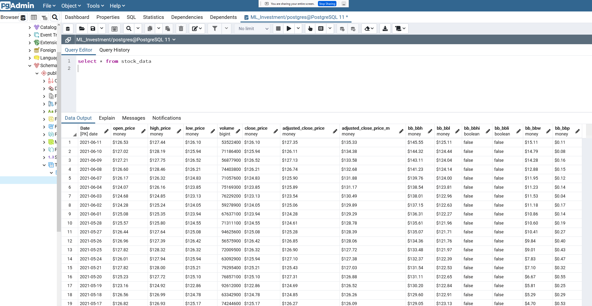

# Group13

## Project purpose

The project purpose is to utilize the correlation between stock price movement and technical analysis to predict future price of a stock using Machine Learning. 
Technical analysis uses technical indicators which are mathematical calculations that are used by traders to predict the future price of a security. The technical indicators that will be used in the study are:
-Simple Moving Average (SMA)
-Relative Strength Index (RSI)
-Bollinger Bands (BB)

The dataset is scraped from Yahoo Finance API based on the stock symbol the user enters. A machine learning model will be created using Close price, Open price, High price, Low price, Adjusted Close price, Volume, SMA, RSI and BB as inputs and the output will be adjusted close price of the security.

## Simple Moving Average
The Simple Moving Average (SMA) is a simple and most commonly used in technical analysis because it helps smooth out the price data over a specified time frame by creating an updated average price.

## Bollinger Bands
A Bollinger Bands is a technical analysis tool defined by a set of trendlines plotted two standard deviations (positively and negatively) away from a simple moving average (SMA) of a security's price, but which can be adjusted to user preferences.

## Relative Strength Index
The relative strength index (RSI) is a momentum indicator used in technical analysis that measures the magnitude of recent price changes to evaluate overbought or oversold conditions in the price of a stock or other asset.

## Application Process Flow Diagram

## ML Mockup

For the Machine Learning we will use the **sklearn.linear_model.LinearRegression** to predict the **Adjusted Close Price**

## Database Schema

##Presentation link on Google Slides

Note: presentation contains Dashboard Storyboard.

